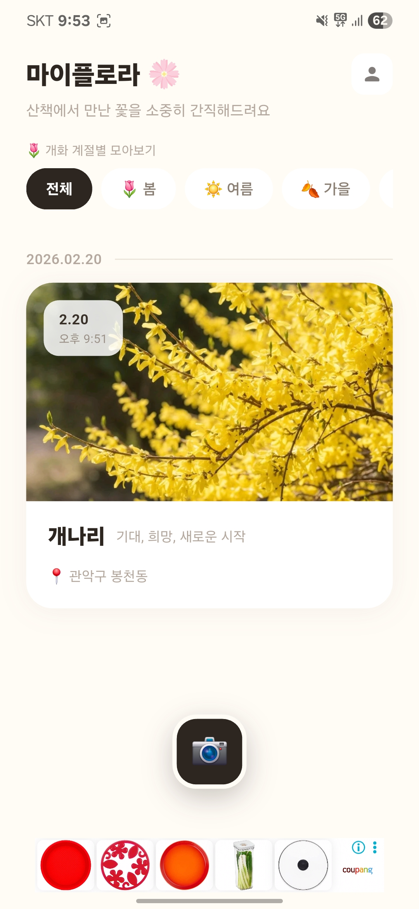
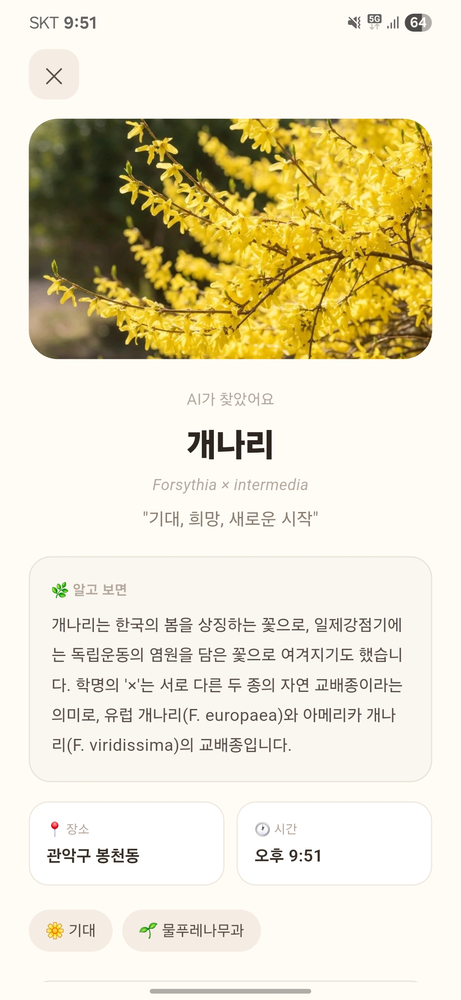
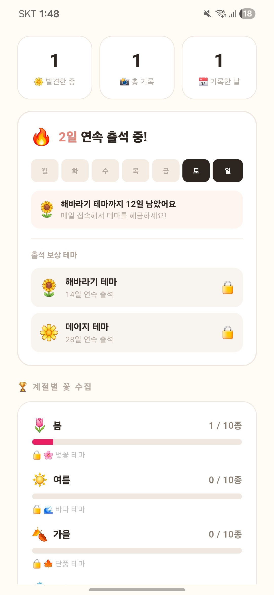

# MyFlora 🌸

**AI 꽃 도감 | AI Flower Guide**

산책에서 만난 꽃을 사진 한 장으로 기록하세요. AI가 꽃 이름, 꽃말, 역사를 알려줍니다.

Snap a photo of any flower — AI identifies it and tells you its name, meaning, and story.

---

## Screenshots

| Home | AI Analysis | Profile |
|:---:|:---:|:---:|
|  |  |  |

---

## Features

- **AI 꽃 인식** — Plant.id API로 30,000종 이상의 꽃을 식별
- **꽃 이야기 생성** — Claude AI가 꽃말, 학명, 역사, 재미있는 사실을 알려줌
- **계절별 컬렉션** — 봄, 여름, 가을, 겨울 꽃을 자동 분류
- **출석 보상** — 매일 접속하면 해바라기(14일), 데이지(28일) 테마 해금
- **위치 기록** — 꽃을 발견한 장소를 자동으로 저장
- **다국어 지원** — 한국어 / English 자동 전환

---

## Architecture

```
lib/
├── main.dart                  # 앱 진입점, Firebase 초기화
├── models/
│   └── flower_memory.dart     # 꽃 기록 데이터 모델
├── providers/
│   └── memory_provider.dart   # Riverpod 상태 관리
├── screens/
│   ├── home_screen.dart       # 메인 (꽃 기록 리스트)
│   ├── capture_screen.dart    # 사진 촬영 + AI 분석
│   ├── detail_screen.dart     # 꽃 상세 정보
│   ├── settings_screen.dart   # 설정 + 테마 선택
│   └── onboarding_screen.dart # 온보딩
├── services/
│   ├── ai_service.dart        # Plant.id + Claude API + 캐싱
│   ├── storage_service.dart   # Hive 로컬 저장소
│   ├── attendance_service.dart# 출석 체크 시스템
│   ├── theme_service.dart     # 테마 관리
│   ├── camera_service.dart    # 카메라/갤러리
│   ├── location_service.dart  # GPS 위치
│   ├── ad_service.dart        # AdMob 광고
│   ├── purchase_service.dart  # 인앱 결제
│   ├── usage_service.dart     # 일일 사용량 제한
│   └── analytics_service.dart # Firebase Analytics
├── routes/
│   └── app_router.dart        # GoRouter 네비게이션
└── l10n/
    └── app_strings.dart       # 다국어 문자열
```

---

## Tech Stack

| Category | Technology |
|---|---|
| Framework | Flutter |
| State Management | Riverpod |
| Navigation | GoRouter |
| Local DB | Hive |
| AI - Flower ID | Plant.id API |
| AI - Story Gen | Claude Haiku 4.5 (Anthropic) |
| Image Compression | flutter_image_compress |
| Analytics | Firebase Analytics |
| Crash Reporting | Firebase Crashlytics |
| Ads | Google AdMob |
| In-App Purchase | in_app_purchase |
| Location | Geolocator + Geocoding |

---

## Key Technical Decisions

**API Cost Optimization**
- Hive 기반 꽃 캐싱: 같은 꽃 재질문 시 Claude API 호출 없이 로컬 캐시 사용 (60~80% 비용 절감)
- 일 3회 무료 인식 제한으로 API 비용 관리

**Performance**
- 이미지 압축: 촬영 사진을 1080px + JPEG 85%로 압축 (90~95% 용량 감소)
- 앱 초기화 병렬 처리 + 5초 타임아웃으로 스플래시 멈춤 방지
- Hive box isOpen 체크로 백그라운드 복귀 시 크래시 방지

**Monetization**
- 배너 + 전면 광고 (AdMob)
- 광고 제거 + 추가 인식권 인앱 결제
